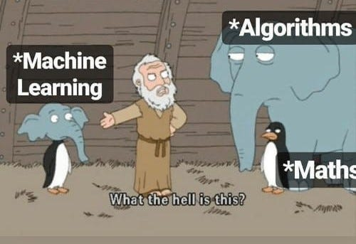
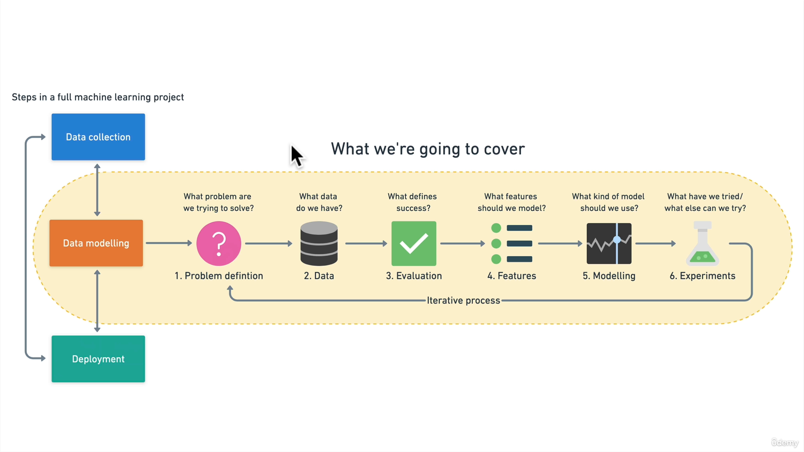

# [Introduction to AI and ML](https://microsoft.github.io/AI-For-Beginners/?id=artificial-intelligence-for-beginners-a-curriculum)


- [OpenAI.com](https://openai.com/)

- [Introduction to AI/ML Concepts](https://mimo.mit.edu/wp-content/uploads/2023/03/mimoDLW23.pdf)
    - [Local PDF source](./Resources/Introduction-to-AI-and-ML.pdf)

- [Getting Started with conda](./Resources/conda-cheatsheet.pdf)


### What most people think AI is... lol ;)


...

### But seriously, It's just complex math, algorithms, and statistics under the hood that we call a `Machine Learning` model, declaratively...

ML in a nutshell ;)



...


## Environment Setup: `Conda` ( Anaconda 3 )
Environment details for re-creation: `environment.yml`

```shell
conda env list
```
```shell
conda create --prefix ./venv numpy pandas matplotlib sklearn jupyter
```
```shell
conda activate \path\to\dir\venv
```
```shell
conda deactivate
```


# Model-training Process



## 1. Problem Definition 

- Supervised Learning

- Unsupervised Learning

- Transfer Learning

- Reinforcement Learning


## 2. Data
`Structured Data`
`Non-structured Data`


- Static Data
  - Comma Separated Values ( .CSV Files)

- Streaming Data
  - When static data is ready for implementation, It has to be updated regularly & it becomes Streaming data...


## 3. Evaluation
`Overperformance`
`Underperformance`

- What defies success? 
  - 95% or 99% or 90% of accuracy...?

    
## 4. Features
- What do we already know about data ?

  - Is it `numerical` or `categorical` feature ?


## 5. Modeling

1. Choosing & Training the Model,  (Training Data)
   - Choose a model according to the problem
     - Model the data into 3 sets individually (Training Data: 70, Validation Data: 15, Test Data: 15), Don't feed the test data directly because, It's a learning process...!

2. Tuning a Model (Validate Data)
   - Tuning the hyperparameters for better performance...!

3. Model Comparison (Test Data)
   - Comparing the different models with their performance
     - Compare apple to apple, not apple to orange...!
     
   - `Under-fitting` & `Over-fitting` both aren't good, isolate your test data from training data to work better in the real world problems...


## 6. Experiments 
- Try -> Fail -> Retry -> Retry -> Some Success -> More Success -> Just keep going...
- An ML model learns by mistakes, just as a human does.

`Note`: Use the right framework for the problem, not the other way around!


## Until next time...

# ;)

