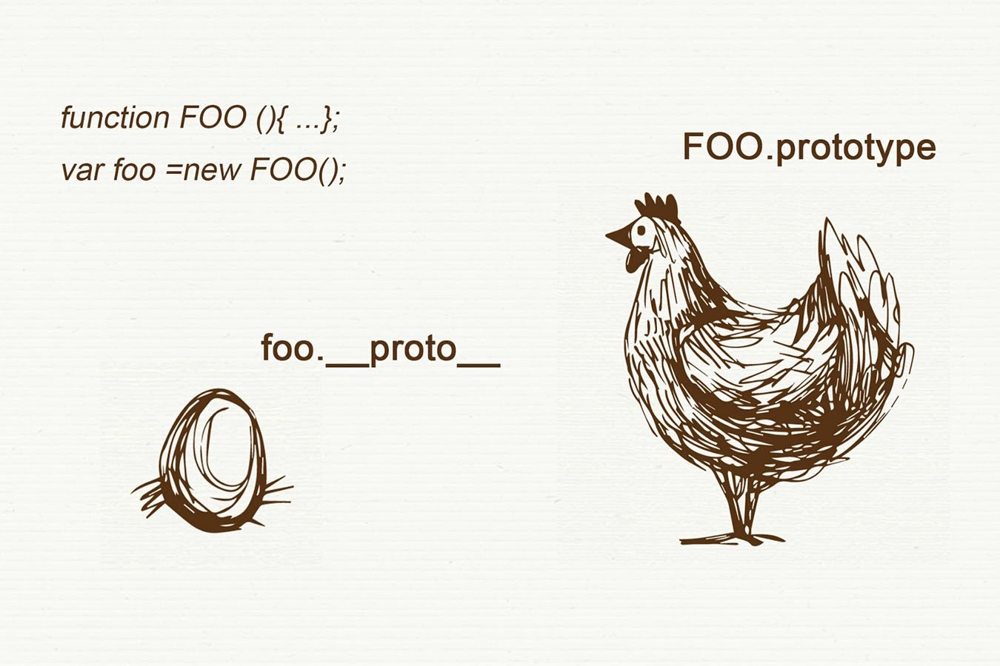
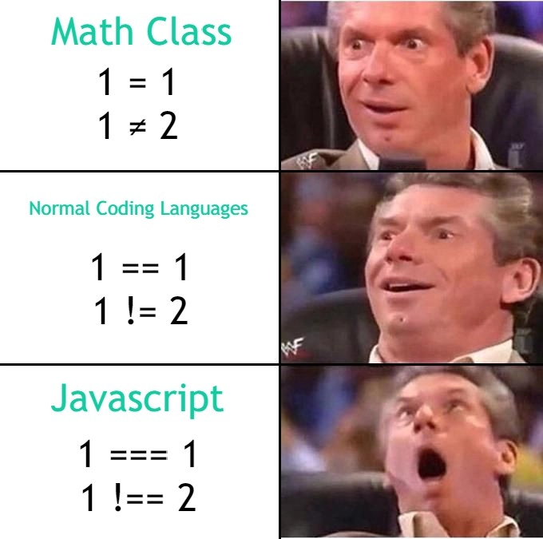
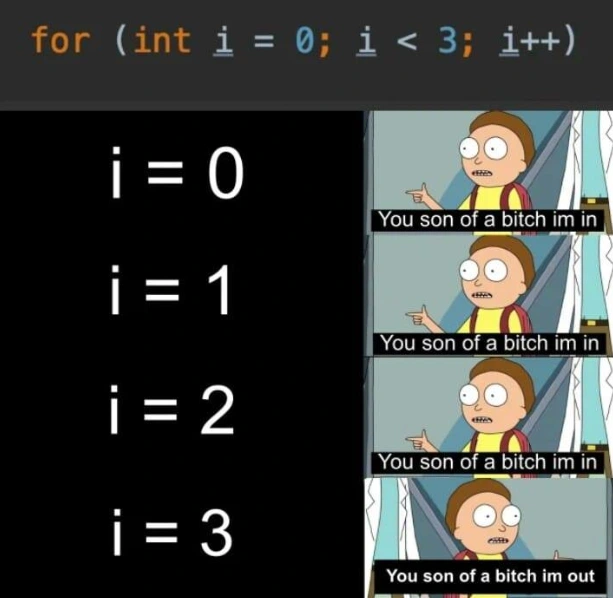

# Advanced JavaScript Concepts with [Fireship.io](https://fireship.io)

- 102

## [🔗 Prototype Chain](https://fireship.io/courses/js/102-prototype-chain/)

Except for the *primitives*, everything in JavaScript is just an **Object**.

- Inheritance between JavaScript Objects

- `{ }`

- `new Object()`

- `.__proto__`

- `Object.setPrototypeOf()`

- `Object.getPrototypeOf()`



```javascript

// animal object
const animal = {
    dna: 'ACGT',
    origin: 'Planet-Earth',
    sleep: () => {
        console.log('...ZZZzzzZZZzzz...')
    }
}

// dog object
const dog = new Object(
    {
        name: 'dwag',
        face: '🐺'
    }
);

// initially, the dog object has no prototype...
console.log(animal.__proto__);       // [Object: null prototype] {}
console.log(dog.__proto__);

// Inherit properties from animal object, yeah! ik...
Object.setPrototypeOf(dog, animal);


// now, the dog object has a prototype...
console.log(dog.__proto__);         // { dna: 'ACGT', origin: 'Planet-Earth', sleep: [Function: sleep] }


console.log(dog.name)        // dwag
console.log(dog.dna)        // ACGT
console.log(dog.sleep())        // ...ZZZzzzZZZzzz...

```

## [🍳 Object {destructuring}](https://fireship.io/courses/js/102-destructuring/)

- DRY code


```javascript
const { name, dna, origin, activate } = starboyObject;
```

`Note:` ***Do Not Repeat Yourself** (*DRY*)

## [👫 ...Spread Operator](https://fireship.io/courses/js/102-spread/)

- `...`

- ...returns a **new** *array[]* or *object{}*

```javascript
const life = [...idk, ...fml]
```

`Note:` where you import *objects* matter, it will **overwrite** the previous values!

## [⛓ Optional Chaining (`?`)](https://fireship.io/courses/js/102-optional-chaining/)

**Error handling* while calling/assigning an object's property that may or may not exist yet!


```javascript
const starboy = homoSapien?.name;
```

## [🦺 Nullish Coalescing (`??`)](https://fireship.io/courses/js/102-nullish-coalescing/)

*JS* is a weakly typed language, so `types` behave a little different than in other languages!

- **Type Coercion**

- `0` is *falsy* by design in the world of *JS*...



```javascript
let reasonsToLive = moments ?? 'None';
```

`Note:` While using `??`, only `null` and `undefined` are considered as **falsy**!

## [🔱 Higher Order Functions ( HOF )](https://fireship.io/courses/js/102-higher-order-functions/)

- A **function** is just an **object** in *JavaScript*, so we can pass functions around like any other object. (*Yeah*! just like a thoughtless child wandering throughout the garden, doin' whatev tf, just living life to its fullest... ;)

### Function Declaration

- *Hoisted*, use anywhere in a file.

- *Global Scope* (*Convention)


```javascript
function add(x, y) {
    return x + y;
}
```

`Note:` **Call** the *function()*

### Function Expression

- *Ain't created until encountered* in the code.

- Can be *named or anonymous*.

- Can be *assigned to a variable* or *passed as an argument* to another function.

- *Local Scope* (*Convention)

#### Function Expression, Named

```javascript
const addFunc = function sum(x, y) {
    return x + y;
}
```

#### Function Expression, Anonymous

```javascript
const fuckFunc = function(x, y) {
    return x * y;
}
```

### Arrow Function

- *goCrazy, do whatever tf you want...

- Good for quick, short functions.

- `=>` / `() =>`

```javascript
someFunc(value => console.log(value))
```

- `() => {}`

```javascript
const subtract = (x, y) => {
    return x - y;
}
```

### HOF

A **higher order function** is a function that takes a function as an argument, or *returns a function*. They are commonly used in functional programming, and are a powerful tool for abstracting away complexity.

- **Callback***s*

```javascript
// a function that takes a function as an argument...
function hofExample(x, y, func) {
    return func(x, y);
}
```

`Note:` It's damn simple, but the way it's used in *different ways* throughout the language is just... ***brain-fuck!**

`Personal Note:` *JavaScript* is fucked, and i love it ;)

## [🫂 Closures ( notThatOne ;) ...this🥡or📦!](https://fireship.io/courses/js/102-closures/)

A **closure** is a `function + outer states/data` that has access to the **parent scope**, even after the parent function has closed. JS will automatically store the state of a *closure* in the **heap memory**, even after the parent function has returned. This behavior makes them useful for *encapsulating private variables*.

- **Open Expression**, Everything that depends on a *parent to send/receive data*, needs to be closed off in a box (**closure**) before *JIT* compilation.

  - Free Variables (*Parent Scope*)

  - Heap Memory (***Long-lived**)
    - Garbage Collector

  - *More memory, more computation...

    - **Data Encapsulation**


```javascript
// Open Expression/Closure
function closure(moments) {
    let theState = 'fucked';
    // console.log(theState)
    function innerClosure() {
        theState = moments ?? 'fuckedAF...';
        // console.log(theState)
        return theState;
    }
    return innerClosure;    // you can make the function anonymous n' return directly... 
}
```


### `Note:` use **closure()()** to call the *function()*

- **Closed Expression**, NO external transactions, *no closure!*   (**self-contained**)

  - **NO Closure**

  - Pure *function()* (**Self-contained**)

  - Stack Memory, Call Stack n' *gone!* (***Short-lived**)

wtf??

```javascript

// Closed Expression/noExternalState/pureFunction()
function pureFun() {
    return 'selfContainedPureFunction';
}
```

## [🍟 Array Tricks](https://fireship.io/courses/js/102-array-tricks/)

Arrays are used to store multiple values in a single variable. Arrays are a special type of *objects*.

- using *let* instead of **const**

```javascript
// array
let someArray = [3, 6, 9, 33, 66, 99, 36, 69, 96];
console.log(someArray);

console.log(typeof (someArray))  // object
```

### Array with a hundred items

```javascript
// array with a hundred items
let anotherArray = Array(100).fill('STUFF');
console.log(anotherArray);

console.log(typeof (Array))     // function
```

### Range ( 1 - 100 )

```javascript
// range ( 1 - 100 )
let rangedArray = Array(100).fill(0).map((_, i) => ++i)
console.log(rangedArray);
```

`Note:` `_` is a convention used when the parameter is not going to be used in the function.

### Range ( 0 - 99 )

- converting an *iterator* to an *array* using the **...spread** syntax.

- Doesn't provide the values, but the *index* of the values.

```javascript
// range ( 0 - 99 )
let anotherRangedArray = [...Array(100).keys()];
console.log(anotherRangedArray);
```

`[...Array(100).keys()]:` The `...` is the spread operator, which takes the iterator returned by `Array(100).keys()` and spreads its values into **A new Array()**.

### Set(), remove duplicates

- `Set()` is a collection of *unique* values.

```javascript
// Set(), remove duplicates.
let uniqueArray = [...new Set(someArray)];   // convert it back to an array
console.log(uniqueArray);
```

## *Imperative Code *Paradigm*

This paradigm is about how to achieve the goal. It involves writing code that describes in **exact steps** what the program must do to achieve a certain *goal*. It's like a detailed recipe. In the given code, a `for of` loop would be an example of imperative programming.

## *Declarative Code *Paradigm*

This paradigm is about what to do, and it lets the language's internals handle how to do it. It involves writing code that describes what you want to achieve, but not necessarily how to achieve it. In the given code, `.forEach()` is an example of declarative programming.

`Note:` *JavaScript* is a **multi-paradigm** language, so you can use both *imperative* and *declarative* programming styles in the same codebase... lol *js*Eh?

### `for of` loop ( *imperative* )

```javascript
// imperative way... ( for of )
for (let i of someArray) {
    console.log(i);
}
```

### Loop over a *Key-Value* Pair

```javascript
// for of with index and values ( .entries() )
for (let [i, val] of someArray.entries()) {
    console.log(i, val);
}
```

### `for in` loop ( **NOT** *recommended!* )

- **NOT** recommended for *iterating* over an *array[]*.
  - it does not guarantee the *order of properties!*

- It's generally *Iterates* over the *enumerable properties* of an *object{}*.



```javascript
// for in ( NOT recommended for arrays!! ), Objects only!
let person = { firstName: 'Sam', lastName: 'Skywalker', age: 21 };

for (let key in person) {
    // it does not guarantee the order of properties
    console.log(key, person[key]);
}
```

### `.forEach()` loop ( *declarative* )

```javascript
// declarative way... ( .forEach() )
someArray.forEach((val) => { console.log(val) });
```

### `.map()`

```javascript
// .map(), creates a new array!
let mappedArray = someArray.map((val) => { return (val * val) });
console.log(someArray);    // the original array is unchanged
console.log(mappedArray);
```

`Note:` **.map()** executes a function for each items in the array, then replaces the values with the *returned values* from the *function()* executed.

### `.filter()`

```javascript
// .filter()
let oddNumbers = someArray.filter((val) => { return (val % 2 !== 0) });
console.log(oddNumbers);
```

`Note:` **.filter()** creates a new array with all the elements that pass the test implemented by the provided function.

### `.find()`

- If nothing's found, it returns `undefined`.

```javascript
// .find()
let firstOddNumber = someArray.find((val) => { return ( val % 2 !== 0) });
console.log(firstOddNumber);
```

`Note:` **.find()** returns the *first* element in the array that satisfies the provided testing function.

### `.findIndex()`

- if no values satisfy the testing function, `-1` is returned.

```javascript
// .findIndex()
let firstOddNumberIndex = someArray.findIndex((val) => { return ( val % 2 !== 0) });
console.log(firstOddNumberIndex);
```

`Note:` **.findIndex()** returns the *index* of the *first* element in the array that satisfies the provided testing function.

### `.reduce()`

```javascript
// .reduce()
let summed = someArray.reduce(( accumulator, currentValue) => { return accumulator + currentValue}, 0);
console.log(summed);
```

`A reducer function` is called for each element in the array, and its return value becomes the accumulator for the next call.

`Note:` **.reduce()** executes a *reducer* function on each element of the array, resulting in a single output value.

### Get a *Random* Element

- Using the `Math` module.

```javascript
// Get a Random Element
let randomShit = someArray[Math.floor(Math.random() * someArray.length)];
console.log(randomShit);
```

`Math.floor()` rounds a number *down* to the nearest integer.

`Math.random()` returns a *random* number between 0 (inclusive), and 1 (exclusive).


## ...untilNextTime!👋

## ;)
