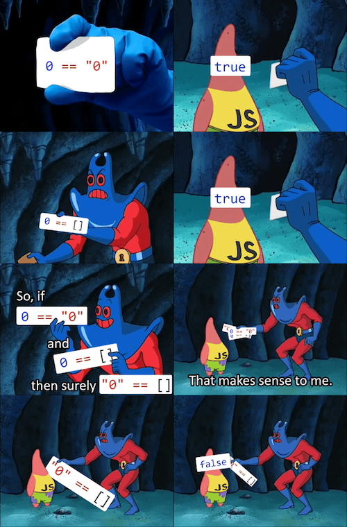

# [Introduction to JavaScript](https://fireship.io/courses/js/101-js-in-100-seconds/)

`NEVER` write Vanilla JavaScript, or you'll end up creating your own little JS Framework, and the last thing this world needs is another JavaScript Framework... ;)

## [JavaScript Data Types & Data Structures](https://developer.mozilla.org/en-US/docs/Web/JavaScript/Data_structures)

### Data Types

1. Number
2. String
3. Boolean
4. Undefined
5. Null
6. Object
7. Symbol (new in ECMAScript 6)

### [Data Structures](https://www.freecodecamp.org/news/data-structures-in-javascript-with-examples/)

`Primitive`

- Arrays ( list )
      - Multidimensional array

- Objects ( map, dictionary, or hash-table )
      - Key-Value pairs

`Non-primitive`

- Stacks

- Queues

- Linked lists

- Trees

- Graphs

- Roundup

## [Comparison Operators](https://developer.mozilla.org/en-US/docs/Web/JavaScript/Guide/Expressions_and_Operators)

- `!==`
      - `!=`

- `===`
      - `==`

- `>=`

- `<=`

- `>`

- `<`

## Variables

Variables are containers for storing data values

- `var`
- `let` ( ES6 )
- `const` ( ES6 )

## Variable naming conventions

- `camelCase`: JavaScript

- `CONSTANTS`: Immutable, Shouldn't be modified...!

- `snake_case`: Python

- `PascalCase`: C/C++

## Conditionals

- `if`
- `else if`
- `else`
- `switch`-`case`
- Ternary Operators ( `?`  `:` )

## Logical Operators

- `&&`: and
- `||`: or
- `!`: not!

## Functions

A function() must `return` something

- const x = function name() {}
- `function name() {}`
- [Arrow Functions](https://developer.mozilla.org/en-US/docs/Web/JavaScript/Reference/Functions/Arrow_functions) ( ES6 ): `() => {}`

## Loops

- `for`
- `forEach` ( ES6 )
- `do`
- `while`

## Some Common Functions

- `alert()`

- `prompt()`

- `clear()`

- `print()`: Print the webpage, not like python...!

## Calculations with Numbers & Strings

### 3 + "6"

- `"36"`

### 9 - "6"

- `3`

### 9 % 3

- `0`

### "Java" + "Script"

- `"JavaScript"`

### " " + " "

- `''`

### " " + 0

- `'0'`

### true + true

- `2`

### true + false

- `1`

### false + true

- `1`

### true - false

- `1`

### false - true

- `-1`

### 6 - 9

- `-3`

### "Starboy" - "Sam"

- `NaN`

### 9 >= 6

- `true`

### 0 === 1

- `false`

### 9 <= 6

- `false`

### 0 !== 0

- `false`

### "A" > "B"

- `false`

### "B" < "C"

- `true`

### "a" > "A"

- `true`

### "b" < "A"

- `false`

### true === false

- `false`

### true != true

- `false`

`NOTE`: Don't stress much about it, It's just how JavaScript works...!

Just for meme purposes... lol ;)

## Make a String

"Hi There! It's sunny out" by using the + sign.

- "Hi There! " + "It\'s \"sunny\" out"

Or, just use the `'`/`"` interchangeably...

## Special Keywords

- break
- case
- catch
- class
- const
- continue
- debugger
- default
- delete
- do
- else
- export
- extends
- finally
- for
- function
- if
- import
- in
- instanceof
- new
- return
- super
- switch
- this
- throw
- try
- typeof
- var
- void
- while
- with
- yield

## Until next time...

## ;)
